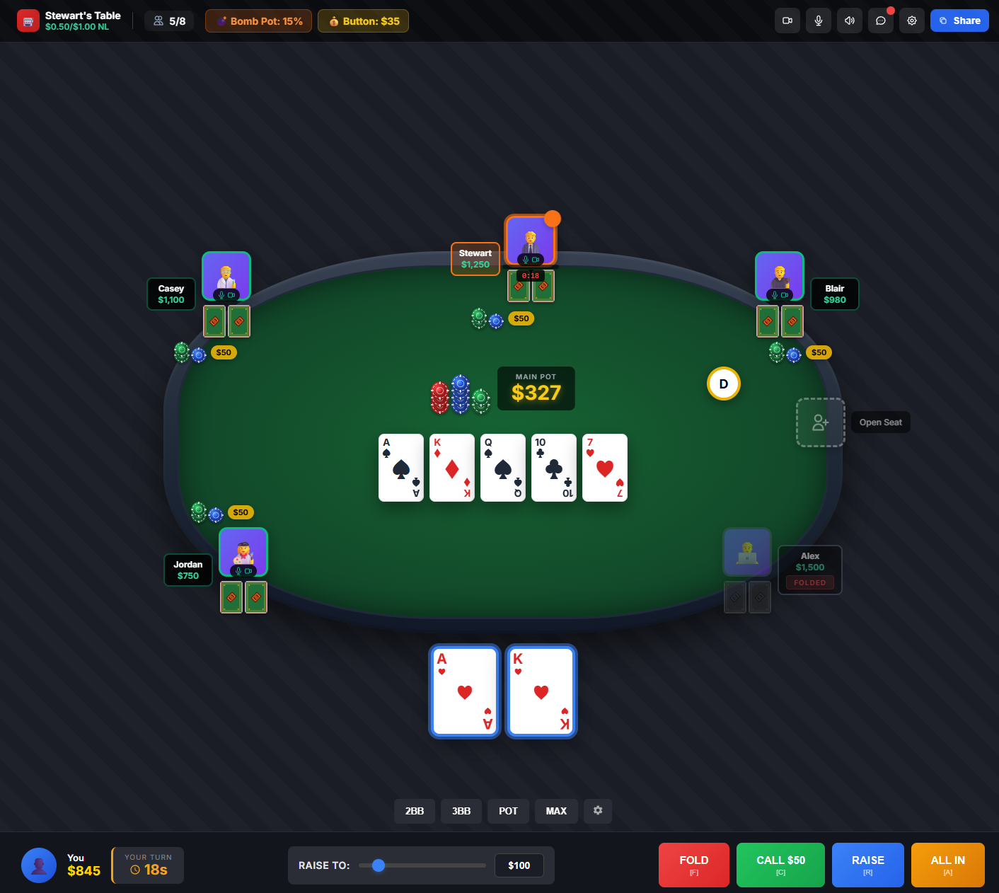

# Low Rollers

Private online poker platform for friend groups with integrated video chat and custom game variants.



## Overview

Low Rollers enables 4-10 friends to play Texas Hold'em online with:
- **Instant guest access** - No registration, just click invite link and enter a display name
- **Integrated video chat** - See and hear everyone, just like a home game
- **Custom variants** - Double board bomb pots and button money
- **Real-time sync** - <100ms action latency with graceful reconnection

## Architecture

```
┌─────────────────────────────────────────────────────────────────────────────┐
│                            ANGULAR 21 FRONTEND                              │
│  ┌──────────────┐    ┌─────────────────┐    ┌──────────────────────────┐   │
│  │ Poker Table  │───▶│ Angular Signals │───▶│ SignalR Client           │   │
│  │ Components   │    │ (State Mgmt)    │    │                          │   │
│  └──────────────┘    └─────────────────┘    └────────────┬─────────────┘   │
└──────────────────────────────────────────────────────────┼─────────────────┘
                                                           │ WebSocket
                                                           ▼
┌─────────────────────────────────────────────────────────────────────────────┐
│                            .NET 10 BACKEND                                  │
│                                                                             │
│  ┌─────────────────────────────────────────────────────────────────────┐   │
│  │                         SignalR GameHub                              │   │
│  │  • Player Actions (Fold/Check/Call/Raise/AllIn)                     │   │
│  │  • Game State Broadcasting (per-player sanitization)                │   │
│  └──────────────────────────────────┬──────────────────────────────────┘   │
│                                     │                                       │
│  ┌──────────────────────────────────▼──────────────────────────────────┐   │
│  │                       Game Orchestrator                              │   │
│  │  ┌─────────────┐  ┌─────────────┐  ┌─────────────┐  ┌────────────┐  │   │
│  │  │ State       │  │ Betting     │  │ Pot         │  │ Action     │  │   │
│  │  │ Machine     │  │ Logic       │  │ Manager     │  │ Timer      │  │   │
│  │  └─────────────┘  └─────────────┘  └─────────────┘  └────────────┘  │   │
│  └─────────────────────────────────────────────────────────────────────┘   │
│                                     │                                       │
│  ┌──────────────────────────────────▼──────────────────────────────────┐   │
│  │                         Domain Services                              │   │
│  │  ┌─────────────────┐  ┌─────────────────┐  ┌─────────────────────┐  │   │
│  │  │ Shuffle Service │  │ Hand Evaluator  │  │ Event Store         │  │   │
│  │  │ (Crypto RNG)    │  │ (7-card eval)   │  │ (Hand History)      │  │   │
│  │  └─────────────────┘  └─────────────────┘  └─────────────────────┘  │   │
│  └─────────────────────────────────────────────────────────────────────┘   │
│                                                                             │
└───────────────┬─────────────────────────────────────────┬───────────────────┘
                │                                         │
                ▼                                         ▼
┌───────────────────────────┐             ┌───────────────────────────────────┐
│         Redis             │             │          PostgreSQL               │
│  • Session State          │             │  • Hand History                   │
│  • Real-time Game State   │             │  • Player Data                    │
└───────────────────────────┘             └───────────────────────────────────┘
```

**Data Flow:** Player Action → SignalR → Orchestrator → Domain Logic → State Update → Broadcast to All Players

## Tech Stack

| Layer | Technology | Notes |
|-------|------------|-------|
| Frontend | Angular 21 | Signals for state management |
| Backend | .NET 10.0 / ASP.NET Core | Clean architecture |
| Real-time | SignalR | WebSocket-based, <100ms latency |
| Video | LiveKit | Self-hosted WebRTC SFU |
| Database | Azure PostgreSQL | Primary data store |
| Cache | Redis | Session and real-time state |
| Hosting | Azure Container Apps | .NET Aspire orchestration |

## Project Structure

```
lowrollers/
├── src/
│   ├── LowRollers.Api/           # .NET API backend
│   │   ├── Domain/               # Core domain models & logic
│   │   │   ├── Betting/          # Action validation, betting rounds
│   │   │   ├── Evaluation/       # Hand evaluation service
│   │   │   ├── Events/           # Event sourcing for hand history
│   │   │   ├── Models/           # Card, Deck, Hand, Player, Table, Pot
│   │   │   ├── Pots/             # Pot management & side pots
│   │   │   ├── Services/         # Cryptographic shuffle
│   │   │   └── StateMachine/     # Hand phase FSM with handlers
│   │   └── Features/
│   │       └── GameEngine/       # SignalR hub, orchestration, timers
│   ├── LowRollers.Web/           # Angular 21 frontend
│   │   └── src/app/
│   │       ├── features/game/    # Poker table component
│   │       └── shared/           # Card component, SVG definitions
│   ├── LowRollers.AppHost/       # .NET Aspire orchestration
│   └── LowRollers.ServiceDefaults/
├── tests/
│   └── LowRollers.Api.Tests/     # xUnit tests
├── docs/
│   ├── designs/                  # UI mockups
│   └── features/                 # Feature task tracking
├── specs/
│   └── poker_brd_v1.1.md         # Business Requirements Document
└── .clavix/                      # Clavix workflow outputs
```

## Implementation Status

### Phase 1: MVP (In Progress)

| Feature | Status |
|---------|--------|
| Core domain models | Done |
| Cryptographic shuffle (Fisher-Yates) | Done |
| Hand evaluation (HoldemPoker.Evaluator) | Done |
| Hand phase state machine | Done |
| Betting logic & action validation | Done |
| Pot management & side pots | Done |
| Event sourcing for hand history | Done |
| Game orchestrator | Done |
| Showdown handler | Done |
| Action timer system | Done |
| SignalR GameHub | Done |
| Game state broadcasting | Done |
| Per-player state sanitization | Done |
| Angular poker table component | Done |
| Player seat component | Done |
| Guest access & table joining | Pending |
| Reconnection handling | Pending |

### Phase 2-4: Future
- Multi-party video chat (LiveKit)
- Bomb pots & button money
- Host configuration
- Multi-table support
- Spectator mode

## Getting Started

### Prerequisites
- [.NET 10 SDK](https://dotnet.microsoft.com/download)
- [Node.js 20+](https://nodejs.org/)
- [Docker Desktop](https://www.docker.com/products/docker-desktop/) (for Redis/PostgreSQL)

### Development

```bash
# Clone the repository
git clone https://github.com/stewart-southwell/lowrollers.git
cd lowrollers

# Start the backend with Aspire
cd src/LowRollers.AppHost
dotnet run

# In another terminal, start the Angular frontend
cd src/LowRollers.Web
npm install
npm start
```

### Running Tests

```bash
# Run all backend tests
dotnet test

# Run frontend tests
cd src/LowRollers.Web
npm test
```

## Documentation

- **BRD:** `specs/poker_brd_v1.1.md` - Business Requirements (1096 lines, 100+ requirements)
- **PRD:** `.clavix/outputs/lowrollers/full-prd.md` - Product Requirements
- **Quick PRD:** `.clavix/outputs/lowrollers/quick-prd.md` - AI-optimized summary
- **Tasks:** `docs/features/*-tasks.md` - Feature task tracking

## Development Phases

1. **Phase 1: MVP** - Core poker gameplay with guest access
2. **Phase 2: Video** - Multi-party video chat integration
3. **Phase 3: Customization** - Bomb pots, button money, host config
4. **Phase 4: Polish** - Multi-table, spectator mode, optional accounts

## License

Private project - not for public distribution.
